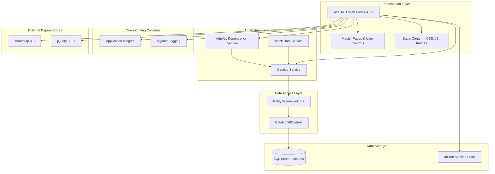

# eShop Legacy Web Forms - Architecture Diagram

This diagram represents the current architecture of the eShop Legacy Web Forms application based on the assessment analysis.

## Application Architecture

## Technology Stack

### Framework & Runtime
- **Platform**: ASP.NET Web Forms 4.7.2
- **Target Framework**: .NET Framework 4.7.2
- **Language**: C#

### Data Access
- **ORM**: Entity Framework 6.2
- **Database**: SQL Server LocalDB (development)
- **Session State**: InProc (non-distributed)

### Dependency Injection
- **Container**: Autofac 4.9.1

### Frontend
- **UI Framework**: Bootstrap 4.3.1
- **JavaScript Library**: jQuery 3.3.1
- **CSS**: Custom CSS + Bootstrap

### Monitoring & Logging
- **Application Monitoring**: Application Insights 2.9.1
- **Logging Framework**: log4net 2.0.10

## Architecture Characteristics

### Current State
- **Architecture Style**: N-Tier Monolith
- **Deployment Model**: IIS Web Application
- **Session Management**: InProc (server memory)
- **Database**: LocalDB (not production-ready)
- **Static Content**: Served from application directory

### Key Components

1. **Presentation Layer**
   - ASP.NET Web Forms pages (.aspx)
   - Master pages for consistent layout
   - User controls for reusable UI components
   - Static assets (CSS, JavaScript, images, fonts)

2. **Service Layer**
   - `ICatalogService` interface
   - `CatalogService` - Database-backed implementation
   - `CatalogServiceMock` - Mock data for testing

3. **Data Layer**
   - Entity Framework 6.2 DbContext
   - POCO entities (CatalogItem, CatalogBrand, CatalogType)
   - Repository pattern via DbContext

4. **Infrastructure**
   - Autofac for dependency injection
   - Application Insights for telemetry
   - log4net for application logging

## Migration Considerations

Based on the assessment, the following areas require attention for cloud migration:

### Scale Issues (2 incidents)
- **Static Content**: 84 static files should be moved to Azure CDN or Blob Storage
- **Session State**: InProc session needs migration to distributed cache (Redis)

### Database (1 incident)
- **LocalDB**: Replace with Azure SQL Database or SQL Server for production

### Connection (1 incident)
- **Connection Strings**: Update to use Azure services

### Identity (1 incident)
- **Authentication**: Consider Azure AD B2C or managed identity

### Security (2 incidents)
- Review and update security configurations for cloud deployment

### Local Dependencies (1 incident)
- Remove or replace local-only dependencies

## Assessment Summary
- **Total Issues**: 7
- **Total Incidents**: 8
- **Estimated Effort**: 24 story points
- **Severity Breakdown**:
  - Mandatory: 2
  - Optional: 4
  - Potential: 2
  - Information: 0
