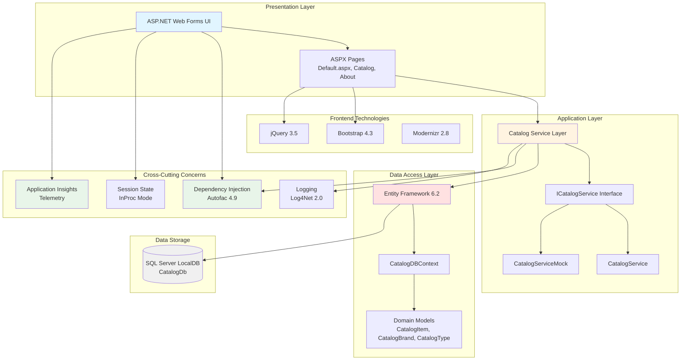

# eShop Legacy Web Forms - Architecture Diagram

## Overview
This diagram represents the current architecture of the eShop Legacy Web Forms application, a traditional ASP.NET Web Forms e-commerce application.

## Current Architecture

## Technology Stack

### Presentation
- **Framework**: ASP.NET Web Forms 4.7.2
- **UI Components**: Bootstrap 4.3.1, jQuery 3.5.0
- **Bundling**: Microsoft.AspNet.Web.Optimization

### Application
- **Service Layer**: Custom service interfaces and implementations
- **Dependency Injection**: Autofac 4.9.1
- **Configuration**: Mock data mode available (UseMockData setting)

### Data Access
- **ORM**: Entity Framework 6.2.0
- **Database Provider**: SQL Server (System.Data.SqlClient)
- **Context**: CatalogDBContext with domain models

### Data Storage
- **Primary Database**: SQL Server LocalDB
- **Database Name**: Microsoft.eShopOnContainers.Services.CatalogDb
- **Session Storage**: In-Process (InProc)

### Monitoring & Logging
- **Application Insights**: 2.9.1 (telemetry and monitoring)
- **Logging**: Log4Net 2.0.10
- **Diagnostics**: Performance counters and dependency tracking

## Key Characteristics

### Architecture Pattern
- **Pattern**: Traditional N-Tier Architecture
- **Layers**: Presentation → Service → Data Access → Database
- **Design**: Interface-based service layer with mock capability

### State Management
- **Session State**: In-Process (server memory)
- **Limitation**: Not suitable for multi-server deployments

### Dependencies
- **Total NuGet Packages**: 46 packages
- **Key Dependencies**:
  - Entity Framework 6.2.0
  - Autofac 4.9.1 (DI container)
  - Bootstrap 4.3.1 (UI framework)
  - Application Insights 2.9.1 (monitoring)

## Migration Considerations

Based on the AppCAT assessment, key areas requiring attention for cloud migration:

### Scale Issues (2 incidents)
- In-process session state limits horizontal scaling
- Consider distributed session state (Redis, SQL Server)

### Connection Issues (1 incident)
- Connection string management for cloud environments
- Consider Azure Key Vault for secrets

### Database Issues (1 incident)
- LocalDB not suitable for production cloud deployments
- Migration to Azure SQL Database recommended

### Identity Issues (1 incident)
- Authentication and authorization modernization needed
- Consider Azure AD B2C or managed identity

### Security Issues (2 incidents)
- Security configurations require updates for cloud
- TLS/SSL configurations and secure communication

### Local Storage (1 incident)
- File system dependencies need to be addressed
- Consider Azure Blob Storage for file storage

## Modernization Opportunities

1. **Platform**: Migrate from ASP.NET Web Forms to ASP.NET Core
2. **Session**: Move to distributed session state (Azure Cache for Redis)
3. **Database**: Upgrade to Azure SQL Database with managed identity
4. **Authentication**: Implement Azure AD B2C
5. **Storage**: Use Azure Blob Storage for static content
6. **Monitoring**: Enhanced Application Insights integration
7. **Hosting**: Deploy to Azure App Service or Azure Container Apps

---

*Generated from AppCAT assessment results*
*Assessment Date: 2026-02-12*
